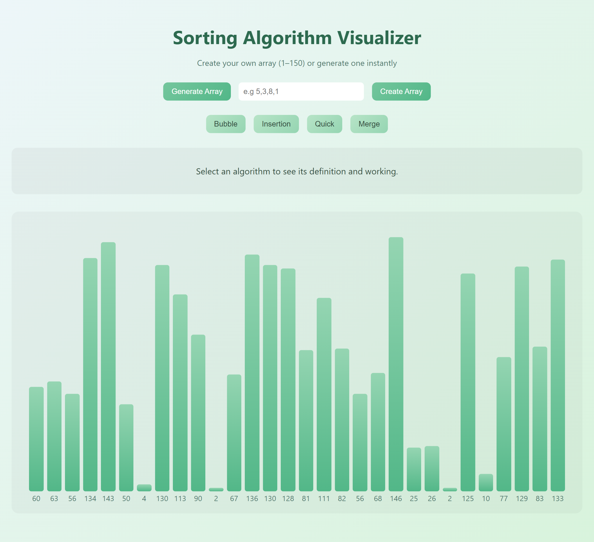
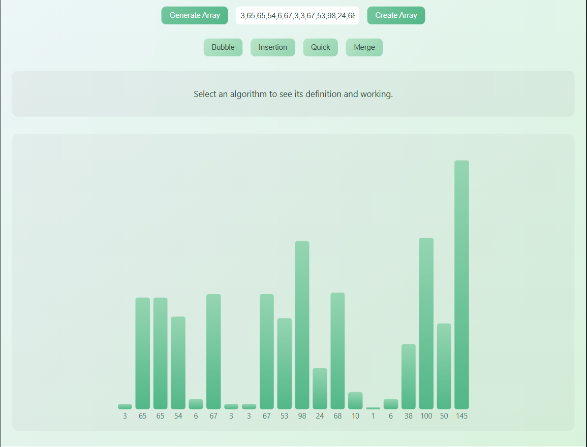
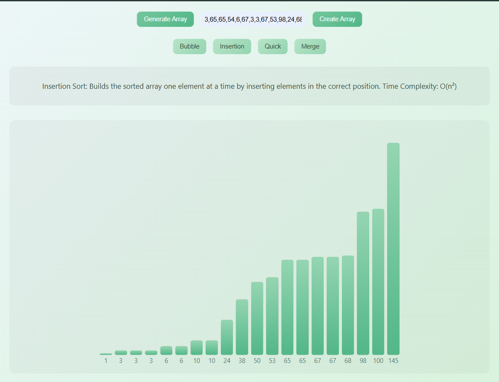

# Sorting Algorithm Visualizer

This project visualizes how different sorting algorithms work using interactive animations built with JavaScript. It helps in understanding how data is rearranged step-by-step during sorting.

---

## 🚀 Algorithms Implemented

- Bubble Sort  
- Insertion Sort  
- Quick Sort  
- Merge Sort  

---

## 🛠 Technologies Used

- HTML  
- CSS  
- JavaScript  

---

## ✨ Features

- Generate random array  
- Input custom array (user-defined values)  
- Visual step-by-step sorting animation  
- Color indication for comparisons  
- Multiple sorting algorithms to compare  

---

## 📊 Algorithm Details

### 🔹 Bubble Sort
- Repeatedly swaps adjacent elements if they are in the wrong order  
- Time Complexity: O(n²)  
- Space Complexity: O(1)  

---

### 🔹 Insertion Sort
- Builds the sorted array one element at a time by inserting elements in the correct position  
- Time Complexity: O(n²)  
- Space Complexity: O(1)  

---

### 🔹 Quick Sort
- Uses divide-and-conquer approach by selecting a pivot and partitioning the array  
- Time Complexity: O(n log n) (average), O(n²) (worst case)  
- Space Complexity: O(log n)  

---

### 🔹 Merge Sort
- Divides the array into halves, sorts them, and merges them back together  
- Time Complexity: O(n log n)  
- Space Complexity: O(n)  

---

## 📥 How to Use

1. Enter numbers separated by commas (e.g. `5,3,8,1`) or generate a random array  
2. Choose a sorting algorithm  
3. Watch the visualization step-by-step  

---

## 📌 Project Purpose

This project is designed for learning and demonstration purposes in the field of algorithms and data structures. It provides a visual understanding of how different sorting techniques operate.

---

## Screenshot
Full Visualizer

User Input Array

User Sorted Array

